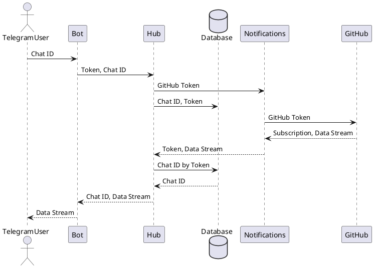

As we discussed [here](https://h1alexbel.github.io/2023/06/11/arc-tools.html),
diagramming is the inevitable activity of software architect and other developers.
Also, [here](https://h1alexbel.github.io/2023/01/21/maintainable-project-template.html) and [here](https://h1alexbel.github.io/2023/04/23/worst-best-practices-of-sd.html) we discuss elegance of software documentation,
that each project must have only one long README file.
Also, your repository should have as little as possible of static files, like images, pdf, etc.
Simply because, git doesn't understand how to do versioning on them.
In this guide, I will show how to compile your diagrams, written in PlantUML notation to SVGs.
As always, fully automated, on GitHub.

<!--more-->


## Create `.puml` Diagram

First, let's create a new diagram in PlantUML notation:


## Create GitHub Workflow:
Then we need to create simple GitHub action for PlantUML.
On each new change it will automatically compile the `.puml` into SVG and push to the git branch.
Here it is:
```yaml
name: plantuml
on:
  push:
    paths:
      - '**.puml'
    branches:
      - master
permissions:
  contents: write
jobs:
  plantuml:
    runs-on: ubuntu-20.04
    steps:
      - name: Checkout Source
        uses: actions/checkout@v2
      - name: Generate SVG Diagrams
        uses: holowinski/plantuml-github-action@main
        with:
          args: -v -tsvg diagrams/*.puml
      - name: Commit changes
        uses: EndBug/add-and-commit@v9
        with:
          author_name: <github nickname>
          author_email: <git email>
          message: 'diagram generated'
          # destination folder
          add: 'diagrams/*'
```
Pay attention to that, this **workflow should be in the master branch first**.

## Create Pull Request with Diagram Changes


## Merge it


After merging it into `master` branch, diagram will be compiled to SVG and pushed there.

## Get the Diagram


Diagramming made easy!

Full example at [blamer-io/hub/#31](https://github.com/Blamer-io/hub/pull/31);
Result is [here](https://github.com/Blamer-io/hub/blob/master/diagrams/sequence.svg).
