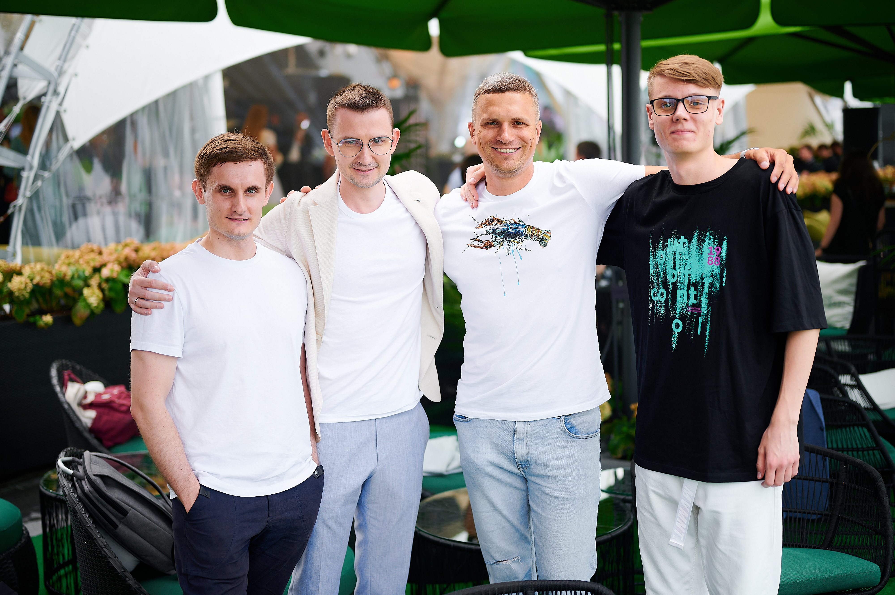

I'm Aliaksei Bialiauski (Russian:
<span lang="ru" xml:lang="ru">Алексей Беля́вский</span>),
an Integration Developer, Architect.

Update: Since July 2022 I'm work as Integration/Java Developer
at [```Solvd```](http://solvd.com).

I am a software developer and architect with a strong background in 
distributed integration systems, and object-oriented analysis and design with Java.
<br>
Tech stack mostly I work with: AWS/GCP, Java, PostgreSQL, Kafka, Kubernetes, Terraform.
<br>
Interested in R&D projects in the area of Integration/Distributed systems.

I am a big open source fan, I found [**EO-CQRS**](https://eo-cqrs.github.io/.github) 
and [**actively contribute**](https://github.com/h1alexbel)
to [**Blamer**](https://blamer-io.github.io/blamer),
and [**others**](/pets.html).

You can sponsor me on [**GitHub**](https://github.com/sponsors/h1alexbel).

Also, I'm making some videos about Software Design, OOAD, and Software Architecture in general.
Check out my [**YouTube channel**](https://www.youtube.com/@absimplearchitect/featured).

Here are [**my favorite books**](/books.html)
about software engineering.

If you are interested, my [**personality type**](https://en.wikipedia.org/wiki/Myers%E2%80%93Briggs_Type_Indicator)
is [**INTJ-A**](/images/personality.png).

Ah, one more thing. I'm a big fan of good movies, so here's
[**my list**](/movies.html) of the ones.
