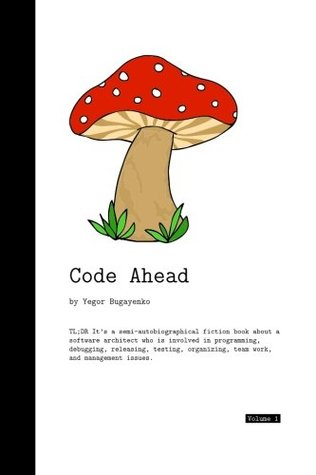

There are plenty of books about software engineering, but only a few of them rank
among
[my favorites](http://astore.amazon.com/yegor256com-20). I read all of those that do over and over again, and I might
just update this post in the future when I stumble upon something else that's decent.

Note that I tried to put the most important books at the top of the list.

 

[**Clean Architecture**]() by Robert C. Martin

 
Text

 

[**Elegant Objects: Volume 1**]() by Yegor Bugayenko

 
Text

 

[**Effective Java**]() by Joshua Bloch

 
Text
 
 
 

 

[**Java Concurrency in Practice**](http://amzn.to/2cs3KZR) by Brian Goetz et al.
 
This is a very practical book about Java multi-threading, and at the same time,
it provides a lot of theoretical knowledge about concurrency in general. I highly
recommend you read it at least once.

 

[**Working Effectively with Legacy Code**]() by Michael C. Feathers

 
Text

 

[**UML Distilled: A Brief Guide to the Standard Object Modeling Language**]() by Martin Fowler

 
Text

 

[**Patterns of Enterprise Application Architecture**]() by Martin Fowler

 
Text

 

[**Microservice Patterns**]() by Chris Richardson

 
Text

 

[**Designing Data-Intensive Applications**]() by Martin Kleppmann

 
Text

[**A Guide to the Project Management Body of Knowledge**]() by Project Management Institute

 
Text

 

[**Code Ahead: Volume 1**]() by Yegor Bugayenko

 
Text

 

[**The Pragmatic Programmer: From Journeyman to Master**]() by Andy Hunt, Dave Thomas

 
Text

 

[**The Passionate Programmer**]() by Chad Fowler

 
Text

Also, check my [GoodReads profile](https://www.goodreads.com/user/show/157275714-aliaksei-bialiauski).