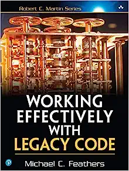
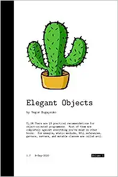
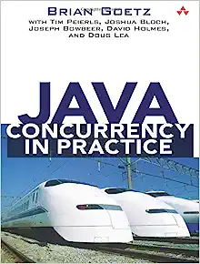
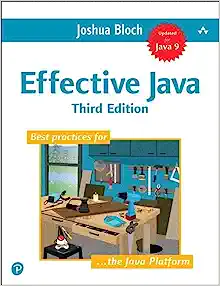
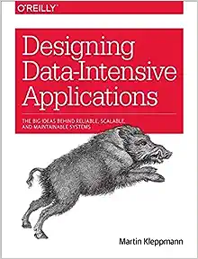
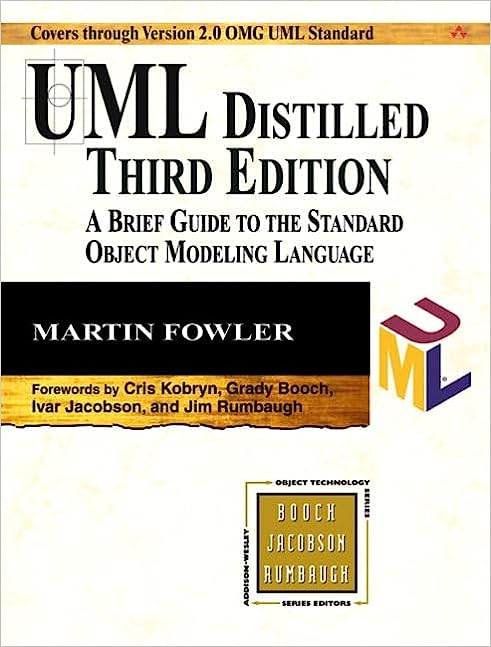
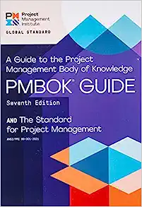
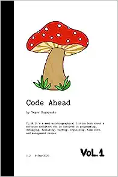
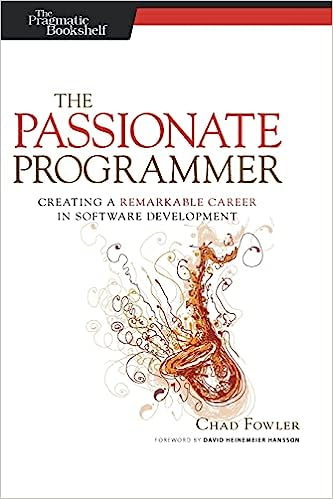

There are plenty of books about software engineering, but only a few of them rank
among my favorites. I read all of those that do over and over again, and I might
just update this post in the future when I stumble upon something else that's decent.

Note that I tried to put the most important books at the top of the list.

- 

* [**Working Effectively with Legacy Code**](https://www.amazon.com/Working-Effectively-Legacy-Michael-Feathers/dp/0131177052) by Michael C. Feathers
 
 

* [**Elegant Objects: Volume 1**](https://www.amazon.com/Elegant-Objects-1-Yegor-Bugayenko/dp/1519166915) by Yegor Bugayenko
 
 

* [**Java Concurrency in Practice**](http://amzn.to/2cs3KZR) by Brian Goetz et al.
 
 

* [**Effective Java**](https://www.amazon.com/Effective-Java-Joshua-Bloch/dp/0134685997) by Joshua Bloch
 
 

* [**Designing Data-Intensive Applications**](https://www.amazon.com/Designing-Data-Intensive-Applications-Reliable-Maintainable/dp/1449373321) by Martin Kleppmann
 
 

* [**UML Distilled: A Brief Guide to the Standard Object Modeling Language**](https://www.amazon.com/UML-Distilled-Standard-Modeling-Language/dp/0321193687) by Martin Fowler
 
 

* [**A Guide to the Project Management Body of Knowledge**](https://www.pmi.org/pmbok-guide-standards/foundational/pmbok) by Project Management Institute
 
 

* [**Code Ahead: Volume 1**](https://www.amazon.com/Code-Ahead-1-Yegor-Bugayenko/dp/1982063742) by Yegor Bugayenko
 
 

* [**The Passionate Programmer: Creating a Remarkable Career in Software Development**](https://www.amazon.com/Passionate-Programmer-Remarkable-Development-Pragmatic-ebook/dp/B00AYQNR5U) by Chad Fowler
