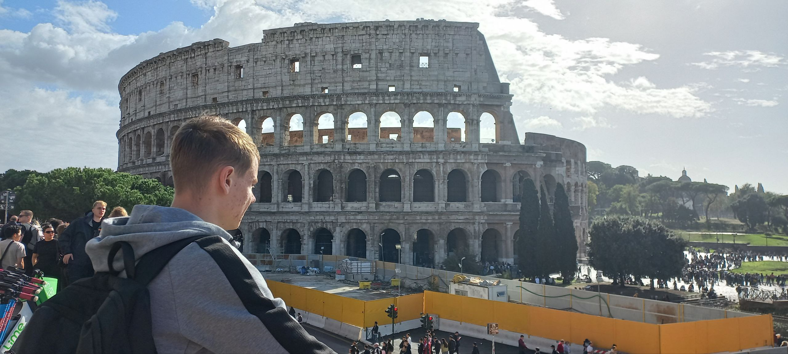

 

I'm Aliaksei Bialiauski, a hands-on programmer, open source contributor. Since
July 2022 I'm working as Java developer at [Solvd].

I'm a hands-on programmer. I do enjoy writing in Java, and sometimes in other
languages too. I feel great contributing to open source projects, that I use on
a daily basis. Check out my [GitHub profile]. I have my own projects too, check
out [this](/pets) list.

I'm interested in committing to computer science in the area of ML/AI-powered
[Program Analysis]. My next nearest goal is to finish my first research paper
in that area.

What about my personal life? I'm a big fan of russian food, [V60], travelling
around the world, and good movies (check out [this](/good-movies.html) list).
If you are interested, my [personality type] is [INTJ-A].

[GitHub profile]: https://github.com/h1alexbel
[Solvd]: https://www.solvd.com
[Program Analysis]: https://en.wikipedia.org/wiki/Program_analysis
[V60]: https://en.wikipedia.org/wiki/Coffee_filter#V60
[personality type]: https://en.wikipedia.org/wiki/Myers%E2%80%93Briggs_Type_Indicator
[INTJ-A]: /assets/images/personality.png
