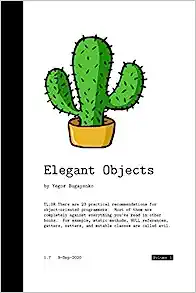
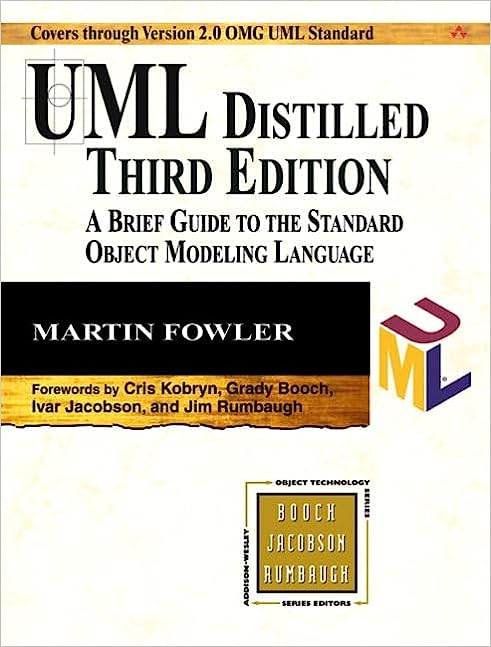

The more books you read, the better structure of knowledge you have, simply that.
There are plenty of books about software engineering, but only a few of them rank
among my favorites.

Note that I've tried to put the most important books at the top of the list.

 
[**Elegant Objects: Volume 1**](https://www.amazon.com/Elegant-Objects-1-Yegor-Bugayenko/dp/1519166915) by Yegor Bugayenko

A great book that brings me a comprehending understanding of Object-Oriented Programming
and gave many coding tips.
Its quite practical and at the same time can be applicable
any "semi-OOP" language.
Book definitely will rewire your brain.

 
* [**UML Distilled: A Brief Guide to the Standard Object Modeling Language**](https://www.amazon.com/UML-Distilled-Standard-Modeling-Language/dp/0321193687) by Martin Fowler
