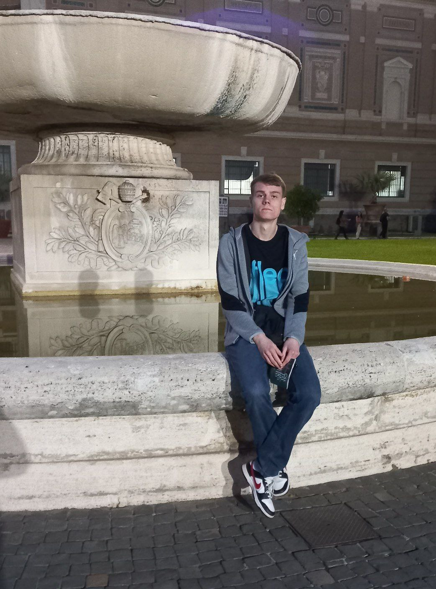

I'm Aliaksei Bialiauski (Russian:
Алексей Беля́вский),
an Integration Developer, Architect, Open Source enthusiast.

Update: Since July 2022 I'm working as Integration/Java Developer
at [Solvd](https://www.solvd.com/).

I am a software developer expert with a strong background in
backend/integration systems, and object-oriented analysis and design with Java.
 
Tech stack mostly I work with: Java, Spring Boot for backend,
PostgreSQL for DB, Kubernetes/Terraform/Helm for ops,
AWS/GCP for cloud stuff, and a little bit of Groovy/Kotlin.
 

I am a big open-source fan, I found a [few](/pets/),
including [EO-CQRS](https://eo-cqrs.github.io/.github)
and [actively contribute](https://github.com/h1alexbel)
to [Blamer](https://blamer-io.github.io/blamer),
[cactoos](https://github.com/yegor256/cactoos)
and others.

Now I'm highly interested in R&D projects in the area of
Productivity Ecosystems in Software Development.
All of it!
Pioneer [project management platforms](http://127.0.0.1:4000/2023/10/22/project-as-a-code.html),
or even Software Development ones,
Programming Languages, Frameworks that will imply simplicity,
traceability and productivity.

Also, I'm making some videos about Software Design, OOAD, and Software Development in general.
Check out my [YouTube channel](https://www.youtube.com/@absimplearchitect/featured).

Here are [my favorite books](/best-books/)
about software engineering.

If you are interested, my [personality type](https://en.wikipedia.org/wiki/Myers%E2%80%93Briggs_Type_Indicator)
is [INTJ-A](/assets/images/personality.png).

Ah, one more thing. I'm a big fan of Russian food,
[Raf](https://en.wikipedia.org/wiki/Raf_coffee) coffee,
and good movies, here's
[my list](/best-movies/) of the ones.

 

 

